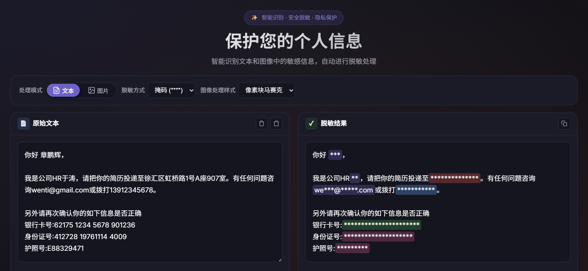

# CN PII Anonymization

中国个人信息脱敏库 - 识别和处理中国大陆个人身份信息(Personally Identifiable Information, PII)

[](https://www.python.org/downloads/)
[](https://opensource.org/licenses/MIT)
[](https://github.com/astral-sh/ruff)

## 项目简介

CN PII Anonymization 是一个专注于中国大陆个人身份信息(PII)识别与脱敏处理的 Python 库。基于 Microsoft Presidio 框架构建，提供文本和图像两种处理模式，支持多种 PII 类型的识别与匿名化处理。

## 效果演示



## 主要特性

### 支持的PII类型

| PII类型 | 实体标识 | 识别方式 | 优先级 | 说明 |
|---------|----------|----------|--------|------|
| 手机号 | `CN_PHONE_NUMBER` | 正则表达式 | P0 | 支持11位手机号、带国际区号(+86/0086)、带分隔符格式 |
| 身份证号 | `CN_ID_CARD` | 正则表达式 | P0 | 支持18位身份证号、OCR错误容错(19位修复) |
| 银行卡号 | `CN_BANK_CARD` | 正则表达式 | P0 | 支持16-19位银行卡号、Luhn算法校验、BIN码识别 |
| 护照号 | `CN_PASSPORT` | 正则表达式 | P0 | 支持中国护照格式(E/G开头+8位数字) |
| 邮箱地址 | `CN_EMAIL` | 正则表达式 | P1 | 标准邮箱格式识别 |
| 详细地址 | `CN_ADDRESS` | 信息抽取(IE) | P2 | 基于PaddleNLP信息抽取模型 |
| 个人姓名 | `CN_NAME` | 信息抽取(IE) | P2 | 基于PaddleNLP信息抽取模型，支持allow_list/deny_list配置 |

### 文本脱敏功能

- **掩码替换**: 将敏感信息替换为星号(*)，支持保留前N位和后N位
- **假名替换**: 使用Faker生成逼真的假数据替换敏感信息
- **自定义配置**: 为不同PII类型配置不同的脱敏策略

### 图像脱敏功能

- **像素块马赛克**: 将识别区域划分为像素块并取平均色
- **高斯模糊**: 对识别区域应用高斯模糊效果
- **纯色填充**: 用指定颜色覆盖识别区域

### 技术特点

- 基于Microsoft Presidio框架，成熟稳定
- 使用PaddleNLP进行中文NLP处理
- 使用PaddleOCR进行图像文字识别
- 支持GPU加速（可选）
- 单例模式设计，资源高效利用
- 完整的API服务支持

## 安装指南

### 环境要求

- Python >= 3.12
- 操作系统: Windows / Linux / macOS

### 使用uv安装（推荐）

本项目使用uv进行依赖管理，推荐使用uv安装：

```bash
# 克隆项目
git clone https://github.com/neednlab/cn_pii_anonymization.git
cd cn_pii_anonymization

# 安装依赖
uv sync
```


### 验证安装

```python
from cn_pii_anonymization import TextProcessor

processor = TextProcessor()
result = processor.process("我的手机号是13812345678")
print(result.anonymized_text)
# 输出: 我的手机号是138****5678
```

## Python库使用示例

### 文本处理

```python
from cn_pii_anonymization import TextProcessor

# 创建处理器
processor = TextProcessor()

# 处理包含PII的文本
text = "张三的手机号是13812345678，身份证号是110101199001011234"
result = processor.process(text)

print(f"原始文本: {result.original_text}")
print(f"脱敏文本: {result.anonymized_text}")
print(f"发现PII: {len(result.pii_entities)}个")

for entity in result.pii_entities:
    print(f"  - {entity.entity_type}: {entity.original_text} -> {entity.anonymized_text}")
```

### 图像处理

```python
from PIL import Image
from cn_pii_anonymization.processors.image_processor import ImageProcessor

# 创建图像处理器
processor = ImageProcessor()

# 加载图像
image = Image.open("document.png")

# 处理图像
result = processor.process(
    image=image,
    mosaic_style="pixel",  # 可选: pixel, blur, fill
    entities=["CN_PHONE_NUMBER", "CN_ID_CARD"]
)

# 保存处理后的图像
result.save_processed_image("redacted_document.png")

# 查看识别到的PII
for entity in result.pii_entities:
    print(f"类型: {entity.entity_type}")
    print(f"文本: {entity.text}")
    print(f"位置: {entity.bbox}")
    print(f"置信度: {entity.score}")
```

### 完整示例
更多完整示例请参考 [examples](./examples) 目录。

## API服务

### 启动API服务

```bash
# 使用uv运行
uv run python main.py

# 或直接运行
python main.py
```

服务启动后访问：
- API服务: http://localhost:8000
- API文档(Swagger UI): http://localhost:8000/docs
- ReDoc文档: http://localhost:8000/redoc
- OpenAPI规范: http://localhost:8000/openapi.json

### API端点列表

| 端点 | 方法 | 描述 |
|------|------|------|
| `/` | GET | API基本信息 |
| `/health` | GET | 健康检查 |
| `/api/v1/text/anonymize` | POST | 文本匿名化 |
| `/api/v1/text/analyze` | POST | 文本分析（仅识别PII） |
| `/api/v1/text/entities` | GET | 获取支持的实体类型 |
| `/api/v1/image/anonymize` | POST | 图像脱敏 |
| `/api/v1/image/analyze` | POST | 图像分析（仅识别PII） |
| `/api/v1/image/mosaic-styles` | GET | 获取支持的马赛克样式 |

### API调用示例

#### 文本匿名化

```bash
curl -X POST "http://localhost:8000/api/v1/text/anonymize" \
  -H "Content-Type: application/json" \
  -d '{
    "text": "张三的手机号是13812345678，身份证号是110101199001011234",
    "entities": ["CN_PHONE_NUMBER", "CN_ID_CARD"],
    "operators": {
      "CN_PHONE_NUMBER": {
        "type": "mask",
        "masking_char": "*",
        "keep_prefix": 3,
        "keep_suffix": 4
      },
      "CN_ID_CARD": {
        "type": "mask",
        "masking_char": "*",
        "keep_prefix": 6,
        "keep_suffix": 4
      }
    }
  }'
```

响应示例：

```json
{
  "code": 200,
  "message": "success",
  "data": {
    "original_text": "张三的手机号是13812345678，身份证号是110101199001011234",
    "anonymized_text": "张三的手机号是138****5678，身份证号是110101********1234",
    "pii_entities": [
      {
        "entity_type": "CN_PHONE_NUMBER",
        "start": 7,
        "end": 18,
        "score": 1.0,
        "original_text": "13812345678",
        "anonymized_text": "138****5678"
      },
      {
        "entity_type": "CN_ID_CARD",
        "start": 24,
        "end": 42,
        "score": 1.0,
        "original_text": "110101199001011234",
        "anonymized_text": "110101********1234"
      }
    ]
  }
}
```

#### 文本分析（仅识别）

```bash
curl -X POST "http://localhost:8000/api/v1/text/analyze" \
  -H "Content-Type: application/json" \
  -d '{
    "text": "联系方式：13812345678，邮箱：test@example.com"
  }'
```

响应示例：

```json
{
  "code": 200,
  "message": "success",
  "data": {
    "pii_entities": [
      {
        "entity_type": "CN_PHONE_NUMBER",
        "start": 5,
        "end": 16,
        "score": 1.0,
        "original_text": "13812345678",
        "anonymized_text": ""
      },
      {
        "entity_type": "CN_EMAIL",
        "start": 21,
        "end": 37,
        "score": 1.0,
        "original_text": "test@example.com",
        "anonymized_text": ""
      }
    ],
    "has_pii": true
  }
}
```

#### 图像脱敏

```bash
curl -X POST "http://localhost:8000/api/v1/image/anonymize" \
  -F "image=@document.png" \
  -F "mosaic_style=pixel" \
  -F 'entities=["CN_PHONE_NUMBER", "CN_ID_CARD"]' \
  --output redacted_document.png
```

#### 图像分析（返回元数据）

```bash
curl -X POST "http://localhost:8000/api/v1/image/anonymize" \
  -F "image=@document.png" \
  -F "mosaic_style=pixel" \
  -F "return_metadata=true"
```

响应示例：

```json
{
  "code": 200,
  "message": "success",
  "data": {
    "pii_entities": [
      {
        "entity_type": "CN_PHONE_NUMBER",
        "text": "13812345678",
        "bbox": {
          "left": 100,
          "top": 200,
          "width": 150,
          "height": 30
        },
        "score": 1.0
      }
    ],
    "ocr_text": "联系方式：13812345678",
    "ocr_confidence": 0.95
  }
}
```

#### 获取支持的实体类型

```bash
curl -X GET "http://localhost:8000/api/v1/text/entities"
```

响应示例：

```json
{
  "code": 200,
  "message": "success",
  "data": {
    "entities": [
      "CN_PHONE_NUMBER",
      "CN_ID_CARD",
      "CN_BANK_CARD",
      "CN_PASSPORT",
      "CN_EMAIL",
      "CN_ADDRESS",
      "CN_NAME"
    ]
  }
}
```

#### 获取支持的马赛克样式

```bash
curl -X GET "http://localhost:8000/api/v1/image/mosaic-styles"
```

响应示例：

```json
{
  "code": 200,
  "message": "success",
  "data": {
    "styles": [
      {
        "name": "pixel",
        "description": "像素块马赛克 - 将区域划分为像素块并取平均色"
      },
      {
        "name": "blur",
        "description": "高斯模糊 - 对区域应用高斯模糊效果"
      },
      {
        "name": "fill",
        "description": "纯色填充 - 用指定颜色覆盖区域"
      }
    ]
  }
}
```

### OpenAPI文档

完整的OpenAPI规范文档可通过以下方式访问：

- **Swagger UI**: http://localhost:8000/docs
- **ReDoc**: http://localhost:8000/redoc
- **OpenAPI JSON**: http://localhost:8000/openapi.json

## 配置说明

### 环境变量配置

创建`.env`文件进行配置：

```env
# 应用配置
APP_NAME=CN PII Anonymization
APP_VERSION=0.1.0
DEBUG=false

# API服务配置
API_HOST=0.0.0.0
API_PORT=8000

# 日志配置
LOG_LEVEL=INFO
LOG_FILE=logs/app.log

# NLP配置
NLP_MODEL=lac
NLP_USE_GPU=false

# OCR配置
OCR_LANGUAGE=ch
OCR_USE_GPU=false
OCR_USE_ANGLE_CLS=true
OCR_DET_THRESH=0.3
OCR_DET_BOX_THRESH=0.5
OCR_DET_LIMIT_SIDE_LEN=960

# 图像处理配置
MAX_IMAGE_SIZE=10485760
MOSAIC_BLOCK_SIZE=10
MOSAIC_BLUR_RADIUS=15

# 识别器置信度阈值配置
SCORE_THRESHOLD_DEFAULT=0.35
SCORE_THRESHOLD_NAME=0.3
SCORE_THRESHOLD_ADDRESS=0.3
SCORE_THRESHOLD_PHONE=0.5
SCORE_THRESHOLD_ID_CARD=0.5
SCORE_THRESHOLD_BANK_CARD=0.5
SCORE_THRESHOLD_PASSPORT=0.5
SCORE_THRESHOLD_EMAIL=0.5

# 姓名识别器自定义列表
NAME_ALLOW_LIST=张三,李四
NAME_DENY_LIST=王五
```

### 置信度阈值说明

不同类型的识别器有不同的置信度特点：

| 识别器类型 | 推荐阈值 | 说明 |
|------------|----------|------|
| 正则类（手机、身份证等） | 0.5 | 置信度固定为1.0，阈值影响较小 |
| IE类（姓名、地址） | 0.3 | 信息抽取模型置信度通常较低(0.3-0.6) |


## 开发指南

### 运行测试

```bash
# 运行所有测试
uv run pytest

# 运行特定测试
uv run pytest tests/unit/test_recognizers.py

# 运行测试并生成覆盖率报告
uv run pytest --cov=src/cn_pii_anonymization
```

### 代码检查

```bash
# 运行ruff检查
uv run ruff check .

# 运行ruff格式化
uv run ruff format .

# 运行mypy类型检查
uv run mypy src/
```

## 性能指标
当前NLP模型识别性能仍在优化中

| 指标 | 目标值 |
|------|--------|
| 单张图片处理时间 | < 100秒（1080p图片） |
| 文本处理时间 | < 5秒 |
| PII识别准确率 | > 95% |

## 依赖说明

### 核心依赖

| 组件 | 版本 | 用途 |
|------|------|------|
| presidio-analyzer | >=2.2 | PII识别引擎 |
| presidio-anonymizer | >=2.2 | PII匿名化引擎 |
| presidio-image-redactor | >=0.0.50 | 图像PII处理 |
| PaddleNLP | >=2.8.1 | 中文NLP处理 |
| PaddleOCR | >=3.1.1 | OCR引擎 |
| PaddlePaddle | >=3.3.0 | 底层框架 |
| FastAPI | >=0.109 | API服务框架 |
| uvicorn | >=0.27 | ASGI服务器 |

## 许可证

本项目采用 MIT 许可证。详见 [LICENSE](license) 文件。

## 限制
- 未实现API身份认证
- 未实现API并发处理和接口限流
- 上述可考虑采用FaaS云函数部署，无需在项目中实现


## 致谢
本项目基于以下优秀开源项目
*   **[Microsoft Presidio](https://github.com/microsoft/presidio)**: 整体PII识别框
*   **[PaddleNLP](https://github.com/PaddlePaddle/PaddleNLP)**: 中文NLP处理库
*   **[PaddleOCR](https://github.com/PaddlePaddle/PaddleOCR)**: 中文OCR引擎